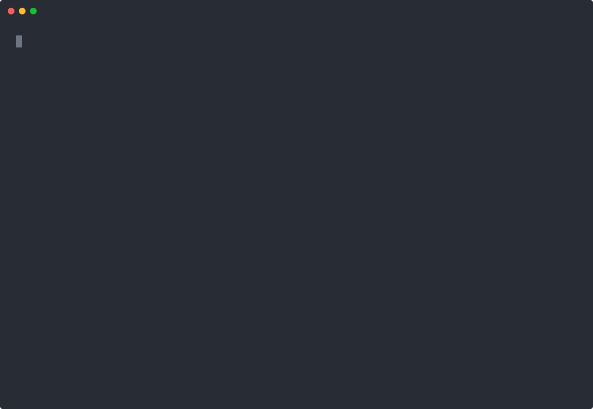

# checkpoint

[](https://github.com/manyapn/checkpoint-public/actions/workflows/ci.yml)

**Version control built for long-running agent sessions.**

Git assumes a person decides when a unit of work is finished, and writes it down. That holds for humans. It breaks the moment an agent works on its own for hours.

- a usable timeline would mean committing CONSTANTLY, and the history becomes noise you have to clean up before anyone can read it
- git records an author per commit, not per change, so inside one working tree it cannot tell the agent's edits from the ones you made alongside them
- a file the agent created and deleted between two commits never existed, as far as git is concerned
- `git checkout .` to undo the agent throws away what you wrote in the same window

checkpoint keeps a second history underneath the one you publish. 

It commits itself, it knows who wrote each file, and it never touches your git history. 

| Coming from git | In checkpoint |
| --- | --- |
| `git commit`, if you remembered to | happens on its own, at every agent turn |
| `git log` | `checkpoint history` |
| `git checkout <sha> -- .` | `checkpoint restore <id>` |
| `git revert` | `checkpoint undo`, which reverts the agent and keeps you |
| `git stash`, decided in advance | nothing to decide: it was already recorded |
| `git gc` | `checkpoint prune` |
| *no equivalent* | `checkpoint recover`, for files that never lived to a commit |

```console
$ checkpoint history
#4   2026-08-04 04:10:16  Fully recoverable             run: ./agent_turn.sh
#3   2026-08-04 04:08:00  Recoverable with exceptions   run: ./agent_turn.sh
      ! .env (not captured: looks like credential material (security default))
#2   2026-08-04 04:07:45  Fully recoverable             manual
#1   2026-08-04 04:07:40  Fully recoverable             setup

$ checkpoint undo
undo of checkpoint 4: reverted 2, removed 0, skipped 0 for review
pre-undo checkpoint 5 saved (restore it to undo this undo)
```



Every step above is asserted against disk state as it runs, and the recording is one unedited take. `make demo` reproduces it on your machine in about four seconds. 

**checkpoint is NOT a replacement for git.** No branches, no merges, no remotes, nothing here is meant to be published or reviewed. Git holds the history of your project. checkpoint holds the history of the session, which git was never built to hold. 

The harder half is coverage. **checkpoint never claims protection it does not have.** Every checkpoint carries a badge (Fully recoverable, Recoverable with exceptions, or Incomplete), every gap names the exact paths it could not cover, and a filesystem that cannot support the full guarantee tells you so when you run `checkpoint doctor`, not when you try to restore. 

---

## What it does that git cannot

- **Reverts by AUTHOR, not by commit.** `undo` puts back what the agent wrote and leaves the file you edited in the same window alone. If you both wrote the same file, it refuses and says so rather than merging or guessing.
- **Restores a workspace that no longer exists.** The history lives outside the project, so `rm -rf` of the project does not touch it. `restore` rebuilds the tree byte-exact, including modes, exec bits, symlink targets and empty directories.
- **Recovers what was never committed.** A file the agent created and deleted inside one turn is still there, because recording is continuous and checkpoints are only labels over it.

## Try it

```sh
git clone https://github.com/manyapn/checkpoint-public
cd checkpoint-public
make build && sudo make install     # installs bin/checkpoint to /usr/local/bin
```

```console
$ cd ~/my-project
$ sudo checkpoint doctor       # will this work here? it answers before you rely on it
$ sudo checkpoint protect      # start recording; cuts a complete baseline now
$ sudo checkpoint run -- claude    # or codex, aider, or any command at all
$ checkpoint history           # the session, turn by turn
$ sudo checkpoint undo         # revert that turn's agent-only changes
```

`make demo` runs the whole story end to end and asserts every claim against disk state, in about four seconds. It is the fastest way to see what this does without wiring it into your own work.

## How it fits together

```
    your project                       the session history (outside the project)
    ------------                       ----------------------------------------
    agent writes  ─┐
                   │   kernel tells checkpoint a file was closed, and hands
    you write     ─┤   over an open handle to it (which is why a deleted
                   │   file is still readable)
                   ▼
              [ capture ] ── who wrote it? walk the process tree back
                   │          to the agent that launched it     [ provenance ]
                   │
                   ├──────────▶ contents, stored by hash        [ objstore ]
                   └──────────▶ one row per write, with author  [ versionlog ]
                                                │
        turn ends, command exits, or you ask ───┤
                                                ▼
                                    a checkpoint: the whole tree,
                                    file by file, at that instant    [ store ]
                                                │
                        history / restore / undo / recover  ◀───────┘
```

The pieces above are the packages: `internal/capture`, `internal/provenance`, `internal/objstore`, `internal/versionlog`, `internal/store`, with `internal/daemon` deciding when a checkpoint happens and `internal/undo` doing the author-scoped revert.

## Reading further

| | |
| --- | --- |
| [Requirements and filesystem support](docs/requirements.md) | Linux, `CAP_SYS_ADMIN`, kernel versions, and exactly what overlayfs costs you |
| [Guarantees, and what is not guaranteed](docs/guarantees.md) | both halves, at equal length |
| [Storage and pruning](docs/storage.md) | what the history costs and how it is bounded |
| [Verify the claims yourself](docs/verify.md) | `selftest` re-runs the guarantees on your machine |
| [Command reference](docs/commands.md) | every command and flag |
| [Measured results](docs/reports/) | real self-test and benchmark output, the machine they came from, and how to reproduce them |

## AI-assisted development

This code was written with AI assistance. This is what I did in the development process to ensure my build was still correct + accurate (a thorough verification system):

- Model knowledge about `fanotify` edge cases is stale or wrong, and the kernel is the only authority. Every claim about watcher semantics had to be backed by a runnable program that exits 0 on a real kernel before it could be written down as fact.
- A gate script could not be edited to make it pass. If a gate looked wrong, the rule is to stop and argue for changing it. 
- Tests are written first, then the code. The tests look at the code as a black box. The gates grep for specific test functions, so a passing run with no tests is a failure.
- All errors were each  reproduced first, then fixed. Each keeps its test as a permanent guard in the spirit of test-driven development.
- Results were scored from the disk-state, as an agent reporting success is not evidence. See the demo for details on this (it asserts against real files, the benchmark fingerprints the tree, and `selftest` re-runs the guarantees on your machine)
- Findings were checked by independent agents prompted to refute them, and the product was tested black-box against the built binary by an agent with no knowledge of the implementation.

## License

MIT. See [LICENSE](LICENSE).
